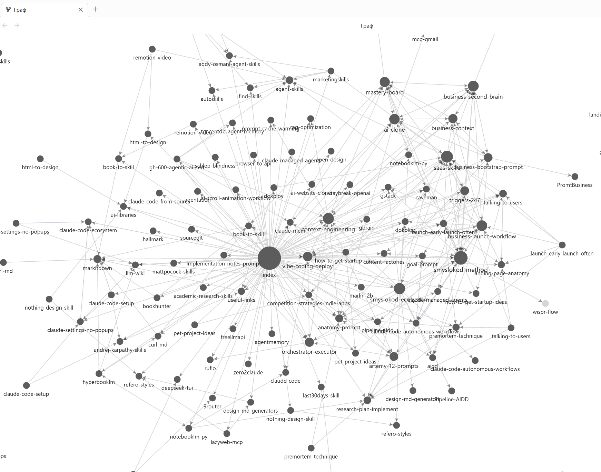

# LLM Wiki 🧠

**A self-maintaining knowledge base where the LLM — not a vector database — is the index.**
Forward a Telegram post, drop a note, or paste a URL → an AI agent researches it, writes a detailed source file and a cross-linked wiki page, updates the navigation index, and commits to git. Turnkey.



*The wiki opened as an [Obsidian](https://obsidian.md) vault — every `related:` link and `[[wikilink]]` becomes an edge, with `index.md` as the hub. The graph grows itself as you forward posts.*

Inspired by [Andrej Karpathy's note-taking method](https://github.com/karpathy): instead of RAG over chunks, you keep a clean, hand-shaped Markdown wiki that the model reads, extends, and links by itself.

🇷🇺 [Русская версия README](README.ru.md)

---

## Why

- **No vector DB, no embeddings, no infra.** Just Markdown files + git + an LLM.
- **The wiki stays human-readable** — open it in any editor, Obsidian, or GitHub.
- **Sources are never lost.** Every page cites canonical URLs (the agent finds them if the post stripped them).
- **Hands-free intake.** A Telegram bot turns "forward → forget" into finished, committed articles.
- **Portable as a skill.** Drop the bundled Claude Code Skill into any project to run wiki operations on demand.

## How it works

```text
                Telegram (forward a post / paste a URL)
                              │
                              ▼
                   scripts/tg_bot.py   ──saves──►  raw/_inbox/<ts>_<source>.md
                              │                     (+ images, + YouTube transcript)
                  (debounce ~60s of silence)
                              │
                              ▼
                   claude -p  (one run per file)
                              │
        ┌─────────────────────┼─────────────────────────────┐
        ▼                     ▼                              ▼
  raw/<topic>.md      knowledge/<cat>/<page>.md        index.md + log.md
  (detailed,          (concise, source URLs,           (navigation +
   enriched via        cross-linked via related:)       append-only history)
   WebSearch)
                              │
                              ▼
                   git add + commit + push   ──►   notifies you in Telegram
```

The method lives in [`CLAUDE.md`](CLAUDE.md) (the agent reads it first) and in the bundled
[`.claude/skills/llm-wiki/SKILL.md`](.claude/skills/llm-wiki/SKILL.md).

## Layout

```text
.
├── CLAUDE.md             # the method (INGEST / QUERY / LINT) — agent reads this first
├── .claude/skills/llm-wiki/SKILL.md   # installable Claude Code Skill
├── raw/                  # source notes (read-only truth)
│   ├── _inbox/           # bot drops forwarded posts here (gitignored)
│   └── _assets/          # images that became part of the knowledge base
├── knowledge/
│   ├── concepts/         # ideas, methods, techniques
│   ├── tools/            # utilities, libraries, services, CLIs, platforms
│   ├── skills/           # Claude Code Skills only
│   └── connections/      # links between topics (X vs Y, X + Y, patterns)
├── daily/                # auto session logs
├── scripts/              # tg_bot.py, flush.py, compile.py, .env.example
├── index.md              # navigation index (updated every INGEST)
└── log.md                # append-only operation history (newest on top)
```

## Prerequisites

- **[Claude Code](https://claude.com/claude-code)** CLI installed and authenticated (`claude` must be on your `PATH` — the bot invokes `claude -p`).
- **Python 3.10+** (for the Telegram bot).
- **git** + a GitHub repo (the bot auto-commits and pushes after each ingest).
- A **Telegram bot token** from [@BotFather](https://t.me/BotFather) and your numeric user ID from [@userinfobot](https://t.me/userinfobot).

## Quick start

### 1. Use this template

Click **“Use this template”** on GitHub (or `git clone` it), then point it at your own private repo:

```bash
git clone https://github.com/AlexKorWeb/llm-wiki.git my-wiki
cd my-wiki
```

> 💡 Keep **your** wiki private — your notes are personal. This repo is just the engine.

### 2. Try it manually (no bot needed)

Drop any note into `raw/`, open Claude Code in the repo, and say:

```text
Обработай raw/my-note.md  (или: "ingest raw/my-note.md")
```

Claude reads `CLAUDE.md`, researches the topic, and produces a `knowledge/` page + updates `index.md` and `log.md`.

You can also just ask questions (QUERY) or request a health check (LINT):

```text
Что у нас по теме X?         # QUERY — answers from the wiki, saves good answers as pages
Проверь вики (lint)          # LINT — broken links, orphans, contradictions, stale pages
```

### 3. Set up the Telegram bot (hands-free intake)

```bash
cd scripts
pip install -r requirements.txt
cp .env.example .env          # then edit .env
```

Fill in `scripts/.env`:

```env
BOT_TOKEN=123456789:AA-your-bot-token
OWNER_USER_ID=000000000       # only you can talk to the bot
DEBOUNCE_SECONDS=60           # wait this long after the last post, then ingest
CLAUDE_MAX_TURNS=60
```

Run it:

```bash
python scripts/tg_bot.py
```

Now **forward any post** (or send a URL / YouTube link / image with a caption) to your bot. After ~60s of silence it runs `claude -p` on each item, writes the articles, commits, pushes, and pings you with a summary. Bot commands: `/status`, `/stop` (plus an inline 🛑 button).

## Obsidian & mobile sync 📱

The wiki is plain Markdown, so it doubles as an **[Obsidian](https://obsidian.md) vault** — just *Open folder as vault* and point it at the repo.

- **Graph view** visualizes the knowledge network: every `related:` entry and every `[[wikilink]]` becomes an edge, with `index.md` as the hub. Watching the graph grow after each ingest is half the fun.
- **Backlinks, full-text search, and tags** work out of the box across your `knowledge/` pages.

### Read & edit on your phone, synced through GitHub

The Telegram bot already commits + pushes after every ingest, so your phone only needs to **pull**:

1. Install **Obsidian** on your phone and open the cloned repo as a vault.
2. Install the **[Obsidian Git](https://github.com/Vinzent03/obsidian-git)** community plugin (works directly on Android; on iOS pair it with [Working Copy](https://workingcopy.app)).
3. Enable **“Pull on startup”** (and an optional auto-pull interval). Now every article the bot generates appears on your phone — graph and backlinks included.

The full loop:

```text
forward a post on your phone
        │
        ▼
bot ingests on your always-on machine  →  git commit + push to GitHub
        │
        ▼
Obsidian Git pulls on your phone  →  you read the finished, cross-linked article
```

> `.obsidian/` is gitignored, so each device keeps its own layout and plugins — install Obsidian Git once per device. (Want shared graph colors/settings? Remove `.obsidian/` from `.gitignore` and commit a minimal config.)

## Running 24/7 (optional)

The bot only works while the process is alive and `claude` is reachable. To keep it always-on:

- **Local:** run it under a process manager (pm2, nssm on Windows, systemd on Linux) or a `tmux`/screen session.
- **Server:** put the repo on a small VPS with Claude Code installed; sync via git.

## Security

- **`scripts/.env` is gitignored** — your bot token never lands in git. Only `.env.example` (placeholders) is committed.
- The bot is **owner-locked**: it ignores everyone except `OWNER_USER_ID`.
- `raw/_inbox/` is gitignored (transient incoming posts); processed images move to `raw/_assets/` and are tracked.
- The agent is instructed never to edit/delete `raw/` and to keep `log.md` append-only.

## Customize

- **Language:** the wiki defaults to Russian prose + English code/terms. Change the language line near the top of `CLAUDE.md` to your preference.
- **Categories:** edit the `knowledge/` folders and the section list in `index.md`.
- **Ingest behaviour:** the full per-file prompt lives in `scripts/tg_bot.py` (`run_ingest`). Tune it to your taste.
- **Skill:** install `.claude/skills/llm-wiki/` into `~/.claude/skills/` to run wiki operations from any project.

## Helper scripts

- `scripts/flush.py "summary" [--files a.md b.md]` — append a session entry to `daily/YYYY-MM-DD.md` (handy as a Claude Code hook).
- `scripts/compile.py --days 30` — summarize recent daily logs and flag knowledge pages worth updating.

## License

[MIT](LICENSE). Built on top of [Claude Code](https://claude.com/claude-code) and [python-telegram-bot](https://github.com/python-telegram-bot/python-telegram-bot).
